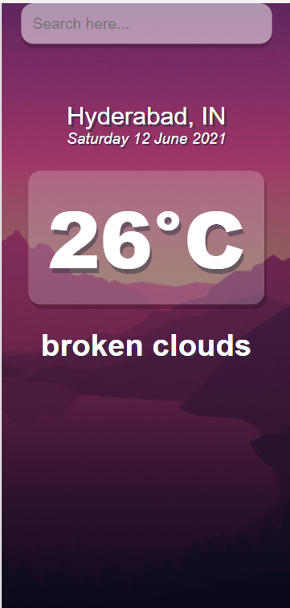
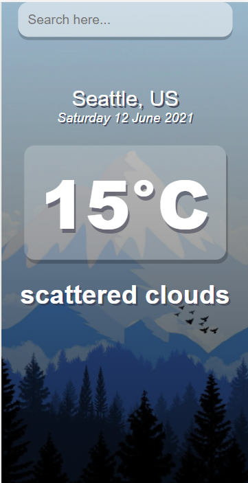

# VAATAVARAN 

  Vaatavaran is a web application created using <b><i>React Js</i></b>. It uses openweathermap API to get weather related data.

  The background changes dynamically based on the temperature at the searched location.

# Output 

  &nbsp;

